# JStyle Closet E-Commerce Website 🛍️

<a id="top"></a>

<details>
<summary> 📋 Table of Contents</summary>

1. [Project Overview](#project-overview)
2. [Team Members](#team-members)
3. [Features](#features)
4. [Built With](#built-with)
5. [System Design](#system-design)
6. [Installation](#installation)
7. [Predefined User Accounts](#predefined-user-accounts)
8. [Usage Guide](#usage-guide)
9. [Project Structure](#project-structure)
10. [Contributions](#contributions)
11. [License](#license)
12. [Acknowledgments](#acknowledgments)
13. [FAQ](#faq)
</details>

<!-- Return to Top Button -->
<a href="#top" id="return-to-top" style="position: fixed; bottom: 20px; right: 20px; background-color: #007bff; color: white; text-decoration: none; padding: 10px 15px; border-radius: 5px; display: none; z-index: 1000;"></a>

<h2 id="project-overview">Project Overview 🌟</h2>

JStyle Closet is a professional online clothing retail e-commerce platform, offering fashionable, high-quality apparel products. The website sells various clothing items, including tops, T-shirts, dresses, and outerwear. Through user authentication, the platform provides different website views for administrators and customers, delivering a smooth shopping experience for users while offering efficient management capabilities for administrators.


<h2 id="team-members">Team Members 👨‍💻</h2>

This project was developed collaboratively by the following team members:

| Name | Role | Contributions |
|------|------|--------------|
| **Teh Chun Shen** | Full Stack Developer | UI/UX design, created system process flows to ensure seamless application logic and participate in backend development |
| **Choo Yit Shern** | Backend Developer | Designed and implemented the database structure and developed endpoints to facilitate communication between the frontend and backend |
| **Liew Zhe Xian** | Frontend Developer | Ensuring responsiveness and visual consistency from user interface and conducted final adjustments |
| **Law Zhe Yin** | Business Analyst | Conducted requirement analysis, prepared detailed documentation and the pitching video presentation |

<h2 id="features">Features 🚀</h2>

### 1. User Registration and Account Management 👤
- **User Login**: Users can log in as regular users or administrators (internal use only)
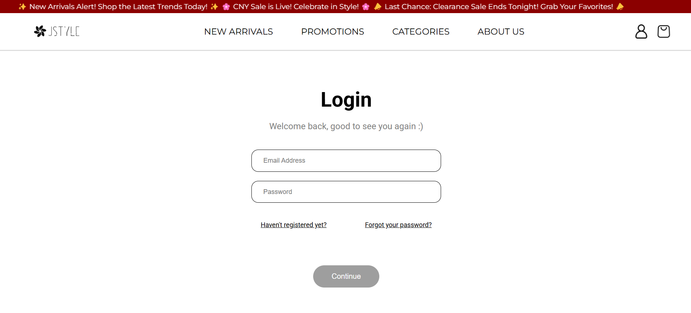

- **User Registration**: New users can register accounts
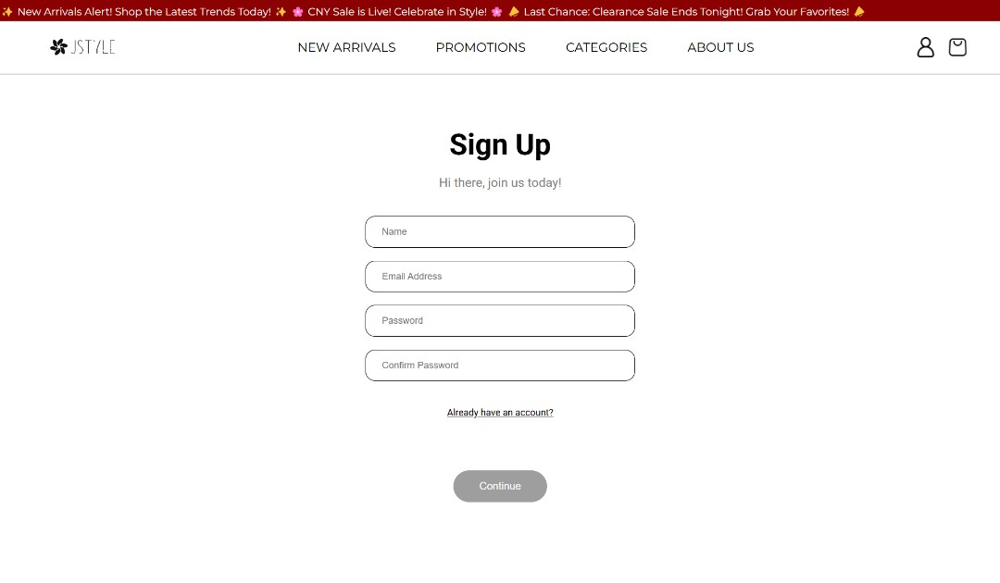

- **Password Reset**: Users can reset their passwords
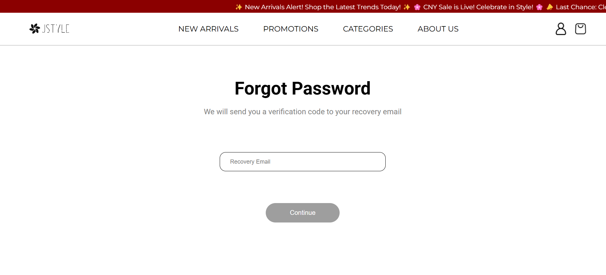

- **User Profile**: Users can view details of their profile
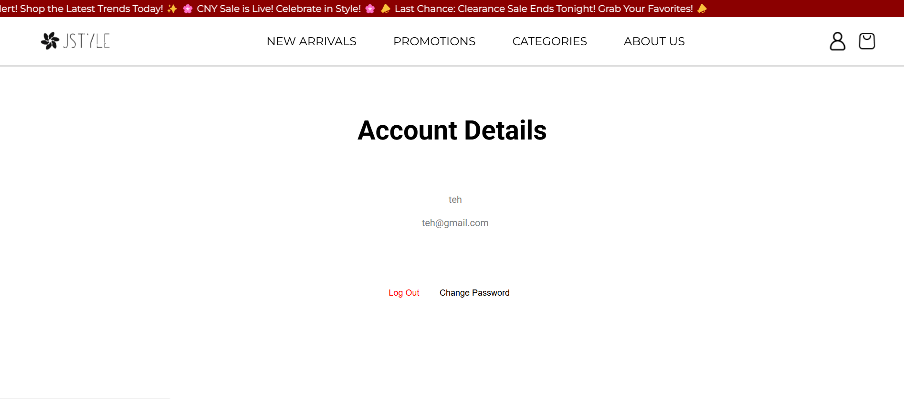

### 2. Product Catalog 📚
- **Categorized Display**: Different categories of products are displayed in different pages/sections
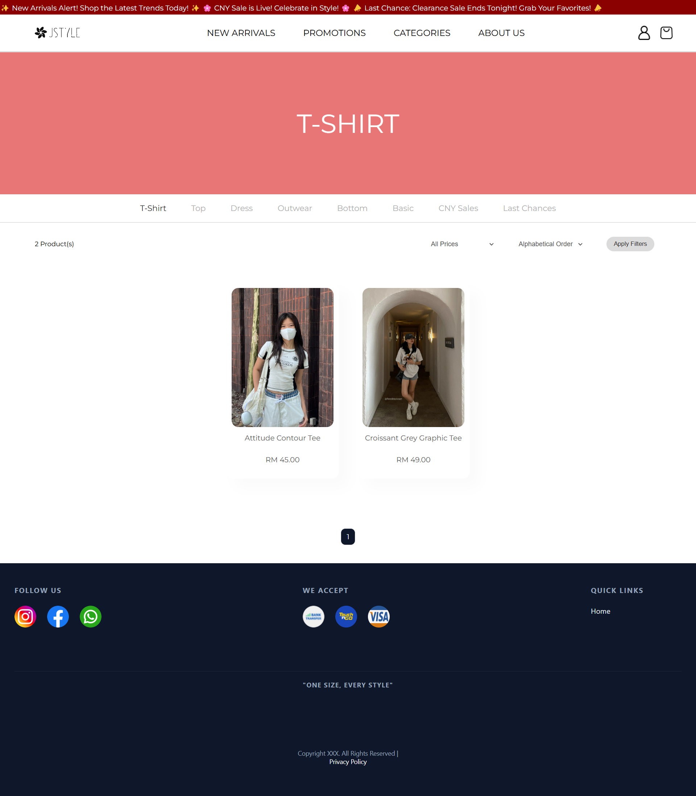

- **Product Catalog**: Users can uncover details of the products.
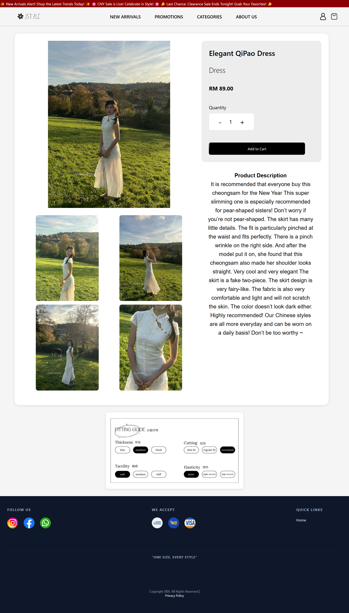

### 3. Shopping Cart 🛒

- **Order Summary**: User can view items added to the cart, overview of the order and apply vouchers for discount!
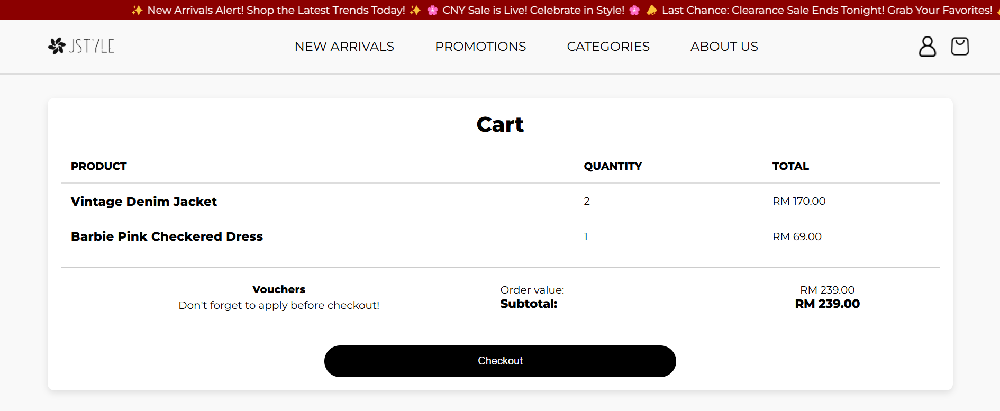

- **Order Placement**: Users can place orders and proceed to payment gateway
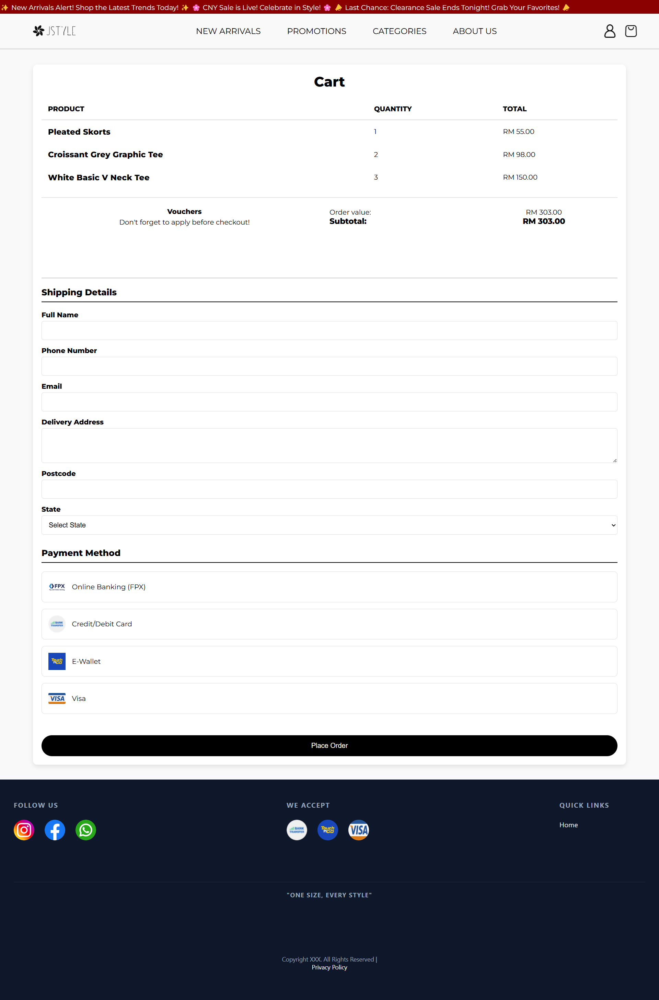

### 4. Administrator Functions ⚙️

- **Admin Dashboard**: Quick view statistical indicators and most recent orders
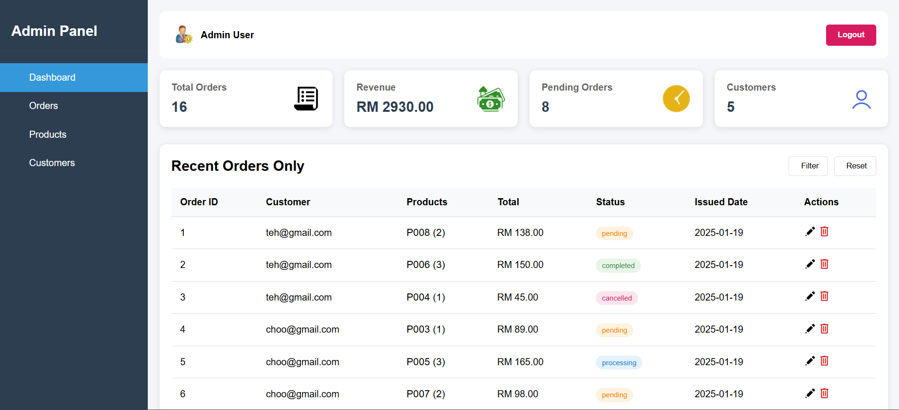
- **Sales Records**: Track sales and user activity, record order history
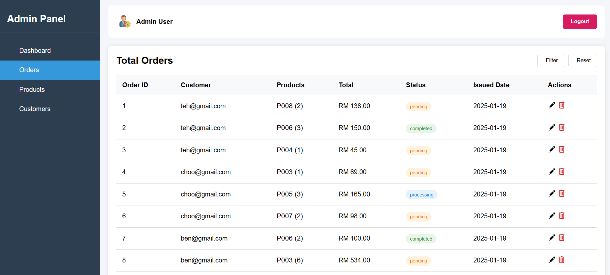
- **Product Management**: Manage products by updating, adding, removing and viewing products to the website
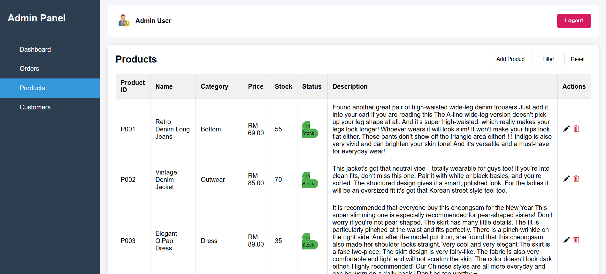
- **User Management**: View user information
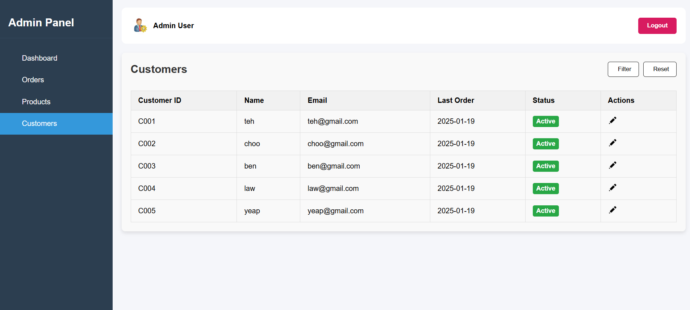


<h2 id="built-with">Built With 🛠️</h2>

<div align="center">

### Frontend Technologies


### Backend Technologies


### Data Storage


### Build & Deployment


</div>


<h2 id="system-design">System Design 📐</h2>

The application follows a Model-View-Controller (MVC) architecture:

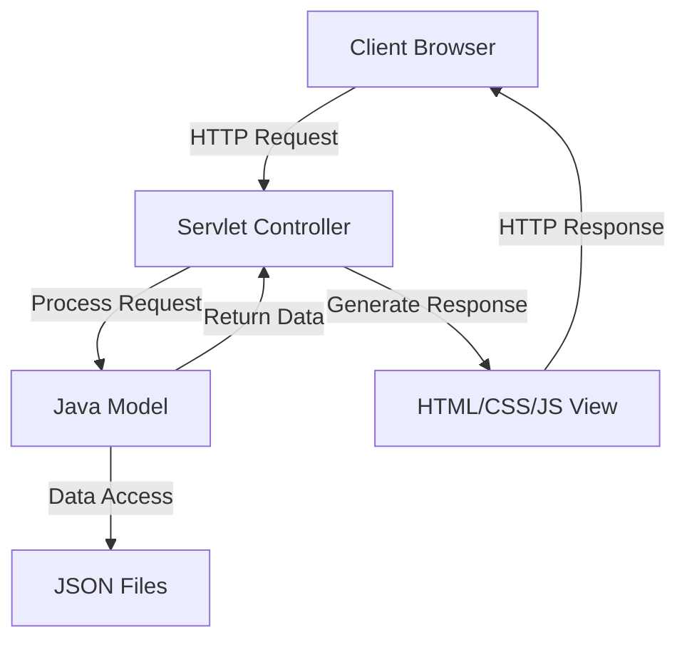

<h2 id="installation">Installation 💻</h2>

### Requirements
- JDK 23
- Apache Tomcat 10.1.34
- Maven 3.x

### Installation Steps

1. **Clone Repository** 📥
   ```bash
   git clone https://github.com/yourusername/CAT-Project-WebApp.git
   cd CAT-Project-WebApp
   ```

2. **Build Project with Maven** 🔨
   ```bash
   mvn clean install
   ```

3. **Configure Tomcat Server** ⚙️
   - Download and install Apache Tomcat 10.x
   - Configure Tomcat server in your IDE (such as IntelliJ IDEA or Eclipse)

4. **Deploy Application** 🚀
   - Deploy the generated WAR file to Tomcat server
   - Or run the project directly through your IDE

5. **Access Application** 🌐
   - After starting the Tomcat server, access in browser: `http://localhost:8080/CAT-Project-WebApp`

### Using Smart Tomcat Plugin (IntelliJ IDEA)

1. Install Smart Tomcat plugin
2. Configure Smart Tomcat:
   ```properties
   Tomcat Server: [Select Tomcat installation directory]
   Deployment Directory: src/main/webapp
   Context Path: /CAT-Project-WebApp
   Server Port: 8080
   ```

3. Run the configured Smart Tomcat

<h2 id="predefined-user-accounts">Predefined User Accounts 🔑</h2>

For testing and demonstration purposes, the following predefined accounts are available:

#### Customer Accounts
| Username | Password | Description |
|----------|----------|-------------|
| `user1@example.com` | `password123` | Regular customer with order history |
| `user2@example.com` | `password123` | New customer with empty cart |

#### Administrator Account
| Username | Password | Description |
|----------|----------|-------------|
| `admin@example.com` | `admin123` | Full administrative access |

> **Note**: These accounts are for demonstration purposes only. In a production environment, you should use secure passwords and implement proper authentication mechanisms.

<h2 id="usage-guide">Usage Guide 📖</h2>

### Data Files 📁

The project uses the following JSON files to store data:
- `products.json`: Stores product information
- `customers.json`: Stores customer information
- `orders.json`: Stores order information

<h2 id="project-structure">Project Structure 🏗️</h2>

The project follows a standard Maven web application structure with MVC architecture:

### Root Structure
```
E-Commerce-Web/
├── src/                  # Source code
├── target/               # Compiled files (generated)
├── pom.xml               # Maven configuration
└── README.md             # Project documentation
```

### Source Code Structure
```
src/
├── main/
│   ├── java/                           # Java source files
│   │   └── com/
│   │       └── ecommerce/
│   │           ├── controller/         # Servlet controllers for handling HTTP requests
│   │           │   ├── AdminServlet.java
│   │           │   ├── CartServlet.java
│   │           │   ├── LoginServlet.java
│   │           │   ├── ProductServlet.java
│   │           │   └── UserServlet.java
│   │           │
│   │           ├── model/              # Data models and business logic
│   │           │   ├── Cart.java
│   │           │   ├── Customer.java
│   │           │   ├── Order.java
│   │           │   └── Product.java
│   │           │
│   │           └── util/               # Utility classes
│   │               ├── DatabaseUtil.java
│   │               ├── JsonUtil.java
│   │               └── SecurityUtil.java
│   │
│   └── webapp/                         # Web resources
│       ├── CSS/                        # Stylesheets
│       │   ├── main.css
│       │   ├── admin.css
│       │   └── responsive.css
│       │
│       ├── js/                         # JavaScript files
│       │   ├── cart.js
│       │   ├── product.js
│       │   └── validation.js
│       │
│       ├── Sources/                    # Images and resources
│       │   ├── logo.png
│       │   ├── products/
│       │   └── icons/
│       │
│       ├── WEB-INF/                    # Configuration files
│       │   └── web.xml
│       │
│       ├── *.html                      # HTML pages
│       │   ├── index.html
│       │   ├── Login.html
│       │   ├── SignUp.html
│       │   ├── AdminPanel.html
│       │   └── ...
│       │
│       └── *.json                      # Data files
│           ├── products.json
│           ├── customers.json
│           └── orders.json
```

### Key Components

- **Controller Layer**: Handles HTTP requests and routes them to appropriate services
- **Model Layer**: Contains business logic and data structures
- **View Layer**: HTML, CSS, and JavaScript files for the user interface
- **Utility Classes**: Helper functions for common operations
- **Data Storage**: JSON files for persistent data storage

<h2 id="contributions">Contributions 🤝</h2>

We welcome contributions from the community! Follow these steps:

1. Fork the project 🍴
2. Create a feature branch
   ```
   git checkout -b feature/AmazingFeature
   ```
3. Commit your changes
   ```
   git commit -m 'Add some AmazingFeature'
   ```
4. Push to the branch
   ```
   git push origin feature/AmazingFeature
   ```
5. Create a Pull Request 📝
6. We'll review your contribution with care and get back to you soon! 👀✨


<h2 id="license">License 📄</h2>

This project is licensed under the USM License - see the LICENSE file or visit the USM Computer Science website for details.

<h2 id="acknowledgments">Acknowledgments 🙏</h2>

- Thanks to all contributors who have helped shape this project
- Special thanks to the CAT201 Software Development course instructors
- Products examples from [FeeDe Closet](https://feedescloset.easy.co/)
- Posters from [TNTCO](https://tntco.co/) and [Stoned & Co.®](https://www.instagram.com/stonedandco/p/DEhStW5ylTc/?img_index=1)
- Icons provided by [FontAwesome](https://fontawesome.com)

<h2 id="faq">FAQ ❓</h2>

<div align="center">
  <h3>Frequently Asked Questions</h3>
  <p>Find answers to common questions about our project</p>
</div>

<div class="faq-container">

  <details>
    <summary><b>🔍 What inspired this website's existence?</b></summary>
    <div>
      <p>This website was made possible thanks to the CAT201 Integrated Software Development Workshop, which provided us with the opportunity to explore, design, and develop a functional website prototype. The experience allowed us to apply our knowledge in a real-world project, enhancing both our technical and problem-solving skills.</p>
    </div>
  </details>

  <details>
    <summary><b>⏱️ How long did it take your team to fully develop this website?</b></summary>
    <div>
      <p>It took us approximately two weeks to develop this website. We started with only basic knowledge of frontend technologies such as HTML, CSS, and JavaScript, and had never worked on backend integration before. Throughout the process, we gained valuable hands-on experience in connecting the frontend with the backend and the developement process of a website.</p>
    </div>
  </details>

  <details>
    <summary><b>👨‍💼 How do I become an administrator?</b></summary>
    <div>
      <p>Administrator accounts are created internally. Please contact the system owner if you need administrator access.</p>
    </div>
  </details>

  <details>
    <summary><b>💎 How do you value the first website you have ever developed?</b></summary>
    <div>
      <p>Although this website has security limitations and resource inefficiencies, it serves as a functional prototype that provides valuable insights. Significant enhancements would be required for real-world deployment. However, we are proud that this project scored 95.5, placing us among the top in our class showing a strong validation of our hard work and dedication.</p>
    </div>
  </details>

  <details>
    <summary><b>🚀 So, what's next move?</b></summary>
    <div>
      <p>Our next steps include:</p>
      <ul>
        <li>Implementing a robust database system (MongoDB or MySQL) to replace JSON-based data storage</li>
        <li>Enhancing the UI/UX design to improve user engagement</li>
        <li>Addressing security limitations, especially for payment transactions and user authentication</li>
        <li>Optimizing performance for handling larger volumes of traffic</li>
      </ul>
    </div>
  </details>
</div>


<p align="center" style="margin-top: 100px;">Thank you for reading our documentation! If you have any questions or suggestions, please don't hesitate to contact us.</p>
<p align="center">© 2025 Our Team - Aim High with Passion</p>
<div align="center">
  <a href="#" style="margin: 0 10px;"></a>
  <a href="#" style="margin: 0 10px;"></a>
  <a href="#" style="margin: 0 10px;"></a>
</div>


<div align="center" style="margin-top: 10px; margin-bottom: 10px;">
  <a href="#top" style="background-color:#050709; color: #c0c0c0; text-decoration: none; padding: 4px; border-radius: 50%; display: inline-block; width: 24px; height: 24px; line-height: 18px; text-align: center; box-shadow: 0 2px 4px rgba(0,0,0,0.9); transition: all 0.3s ease;">
    <span style="font-size: 16px; font-family: 'Georgia', serif;">↑</span>
  </a>
</div>
