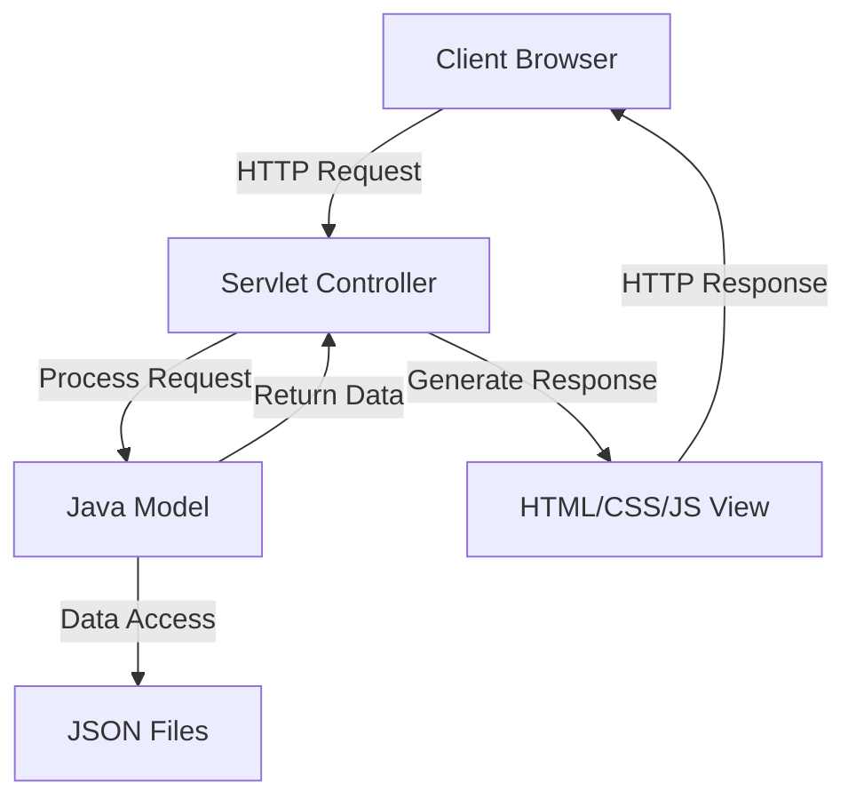

# JStyle Closet E-Commerce Website 🛍️

<details>
<summary>📋 Table of Contents</summary>

1. [Features](#features)
2. [Built With](#built-with)
3. [System Design](#system-design)
4. [Installation](#installation)
5. [Usage Guide](#usage-guide)
6. [Contributions](#contributions)
7. [License](#license)
8. [Acknowledgments](#acknowledgments)
9. [FAQ](#faq)
</details>

## Project Overview 🌟

JStyle Closet is a professional online clothing retail e-commerce platform, offering fashionable, high-quality apparel products. The website sells various clothing items, including tops, T-shirts, dresses, and outerwear. Through user authentication, the platform provides different website views for administrators and customers, delivering a smooth shopping experience for users while offering efficient management capabilities for administrators.

## Features 🚀

### 1. User Registration and Account Management 👤
- **User Login**: Users can log in as regular users or administrators (internal use only)
- **User Registration**: New users can register accounts
- **Password Reset**: Users can reset their passwords

### 2. Product Catalog 📚
- **Categorized Display**: Different categories of products are displayed in different pages/sections
- **Filtering Function**: Users can apply filters to sort displayed products
- **Search Functionality**: Find products quickly with our powerful search feature

### 3. Shopping Cart 🛒
- **Add Products**: Users can add desired products to their shopping cart
- **Order Placement**: Users can place orders for products
- **Quantity Management**: Easily adjust product quantities in your cart

### 4. Administrator Functions ⚙️
- **User Management**: View user information
- **Product Management**: Add new products to the website
- **Sales Records**: Record sold products
- **Analytics Dashboard**: Track sales and user activity

## Built With 🛠️

```
┌─────────────────────────────────────────┐
│ Frontend                                │
├─────────────────────────────────────────┤
│ HTML | CSS | JavaScript                 │
└─────────────────────────────────────────┘

┌─────────────────────────────────────────┐
│ Backend                                 │
├─────────────────────────────────────────┤
│ Java Servlet                            │
└─────────────────────────────────────────┘

┌─────────────────────────────────────────┐
│ Data Storage                            │
├─────────────────────────────────────────┤
│ JSON Files                              │
└─────────────────────────────────────────┘

┌─────────────────────────────────────────┐
│ Build Tool & Server                     │
├─────────────────────────────────────────┤
│ Maven | Apache Tomcat                   │
└─────────────────────────────────────────┘
```

## System Design 📐

The application follows a Model-View-Controller (MVC) architecture:



## Installation 💻

### Requirements
- JDK 23
- Apache Tomcat 10.x
- Maven 3.x

### Installation Steps

1. **Clone Repository** 📥
   ```bash
   git clone https://github.com/yourusername/CAT-Project-WebApp.git
   cd CAT-Project-WebApp
   ```

2. **Build Project with Maven** 🔨
   ```bash
   mvn clean install
   ```

3. **Configure Tomcat Server** ⚙️
   - Download and install Apache Tomcat 10.x
   - Configure Tomcat server in your IDE (such as IntelliJ IDEA or Eclipse)

4. **Deploy Application** 🚀
   - Deploy the generated WAR file to Tomcat server
   - Or run the project directly through your IDE

5. **Access Application** 🌐
   - After starting the Tomcat server, access in browser: `http://localhost:8080/CAT-Project-WebApp`

### Using Smart Tomcat Plugin (IntelliJ IDEA)

1. Install Smart Tomcat plugin
2. Configure Smart Tomcat:
   ```properties
   Tomcat Server: [Select Tomcat installation directory]
   Deployment Directory: src/main/webapp
   Context Path: /CAT-Project-WebApp
   Server Port: 8080
   ```

3. Run the configured Smart Tomcat

## Usage Guide 📖

### Customer Journey Map

```
┌─────────────┐     ┌─────────────┐     ┌─────────────┐     ┌─────────────┐
│  Register/  │     │   Browse    │     │ Add to Cart │     │  Checkout   │
│    Login    │ ──> │   Products  │ ──> │ & Review    │ ──> │ & Payment   │
└─────────────┘     └─────────────┘     └─────────────┘     └─────────────┘
```

### Data Files 📁

The project uses the following JSON files to store data:
- `products.json`: Stores product information
- `customers.json`: Stores customer information
- `orders.json`: Stores order information

## Project Structure 🏗️

```
src/
├── main/
│   ├── java/
│   │   └── com/
│   │       └── ecommerce/
│   │           ├── controller/ (Servlet controllers)
│   │           ├── model/ (Data models)
│   │           └── util/ (Utility classes)
│   └── webapp/
│       ├── CSS/ (Stylesheets)
│       ├── js/ (JavaScript files)
│       ├── Sources/ (Images and resources)
│       ├── WEB-INF/ (Configuration files)
│       ├── *.html (Various pages)
│       └── *.json (Data files)
```

## Contributions 🤝

We welcome contributions from the community! Follow these steps:

1. Fork the project 🍴
2. Create a feature branch (`git checkout -b feature/AmazingFeature`)
3. Commit your changes (`git commit -m 'Add some AmazingFeature'`)
4. Push to the branch (`git push origin feature/AmazingFeature`)
5. Create a Pull Request 📝

## License 📄

This project is licensed under the MIT License - see the LICENSE file for details.

## Acknowledgments 🙏

- Thanks to all contributors who have helped shape this project
- Special thanks to the CAT201 Software Development course instructors
- Icons provided by [FontAwesome](https://fontawesome.com)

## FAQ ❓

<details>
<summary><b>How do I reset my password?</b></summary>
<p>Click on the "Forgot Password" link on the login page and follow the instructions sent to your email.</p>
</details>

<details>
<summary><b>Can I change my shipping address after placing an order?</b></summary>
<p>Yes, you can update your shipping address by contacting customer support within 24 hours of placing your order.</p>
</details>

<details>
<summary><b>How do I become an administrator?</b></summary>
<p>Administrator accounts are created internally. Please contact the system owner if you need administrator access.</p>
</details>
